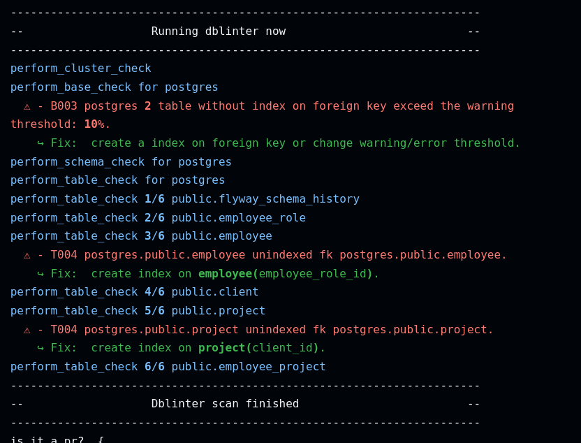
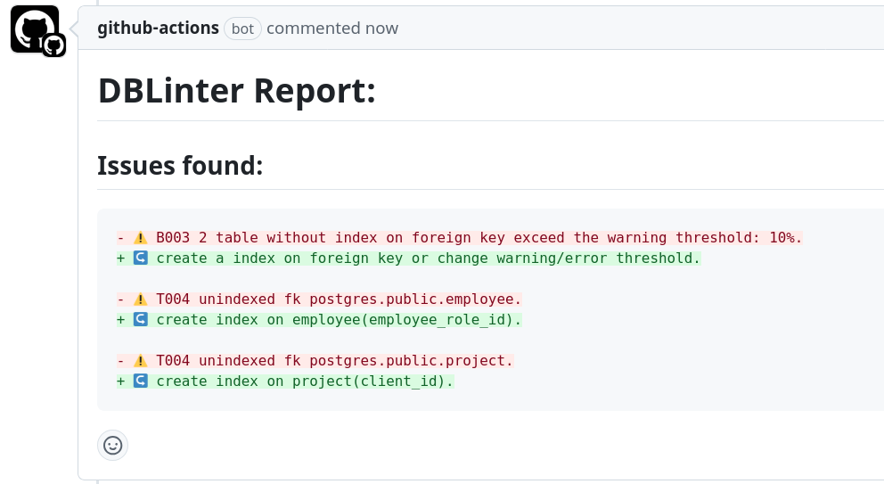

# dblinter GitHub Action

You can launch pretty easily [dblinter](https://github.com/decathlon/dblinter) with an existing database.
But if you want to run this as a quick check on your CI/CD pipeline, you may not have the database instance ready.

This GitHub Action launches a PostgreSQL database, runs Flyway migrations and/or an initial script, then runs [dblinter](https://github.com/decathlon/dblinter) to generate a SARIF report.

Flyway migration will be run before the "init-script" if both are provided.

The db linter output is available:
- As a SARIF report file (see report-path input)
- in the logs 
- It is also possible to display the report in a PR comment if you are on a PR and if you ask for it. 


## Inputs

- `flyway-migration` (optional): Path to the Flyway migration directory. Default is an empty string (no flyway migration).
- `init-script` (optional): Path to the initial script (a sql file). Default is an empty string (no init sql file).
- `config-file` (optional): Path to your rule configuration file. Default is an empty string, so that default rules are checked.
- `report-path` (required): Path to write the SARIF report file. Default is `dblinter.sarif`.
- `dblinter-version` (optional): Version of `dblinter` to use. This action will follow the latest stable version.
- `postgres-version` (optional): Version of `postgres` to use. Default is `17`.
- `flyway-version` (optional): Version of `flyway` to use. Default is `10`.
- `pr-comment` (optional): If `true` display the report in the PR. Default is `false`.
- `GITHUB_TOKEN` (optional): GitHub token to create the PR comment if the option is enable and effective. Default is `${{ github.token }}`.

## Outputs

- `sarif-report`: Path where the SARIF report is stored.

Logs in the action will also display the issue found by `dblinter`.

## Usage

```yaml
name: Run dblinter -- quality
on: [push, pull_request]

jobs:
  run-dblinter:
    runs-on: ubuntu-latest
    steps:
      - name: Checkout code
        uses: actions/checkout@v4

      - name: Run dblinter
        uses: dktunited/dblinter
        with:
          flyway-migration: 'path/to/migration'
          init-script: 'path/to/init/script'
          report-path: 'path/to/report.sarif'
```
